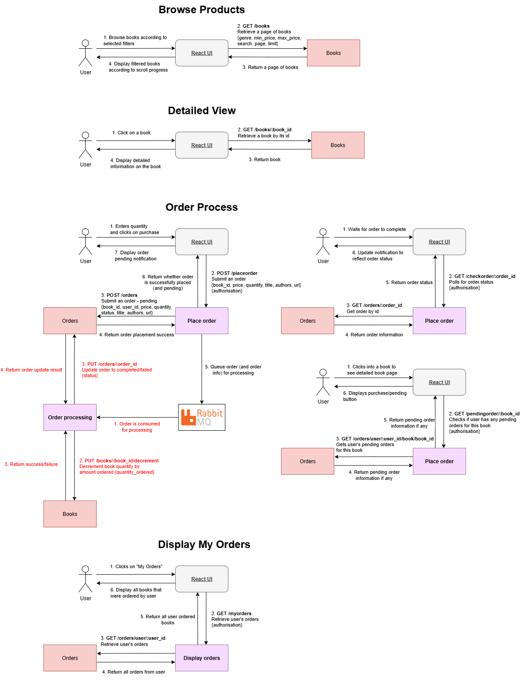
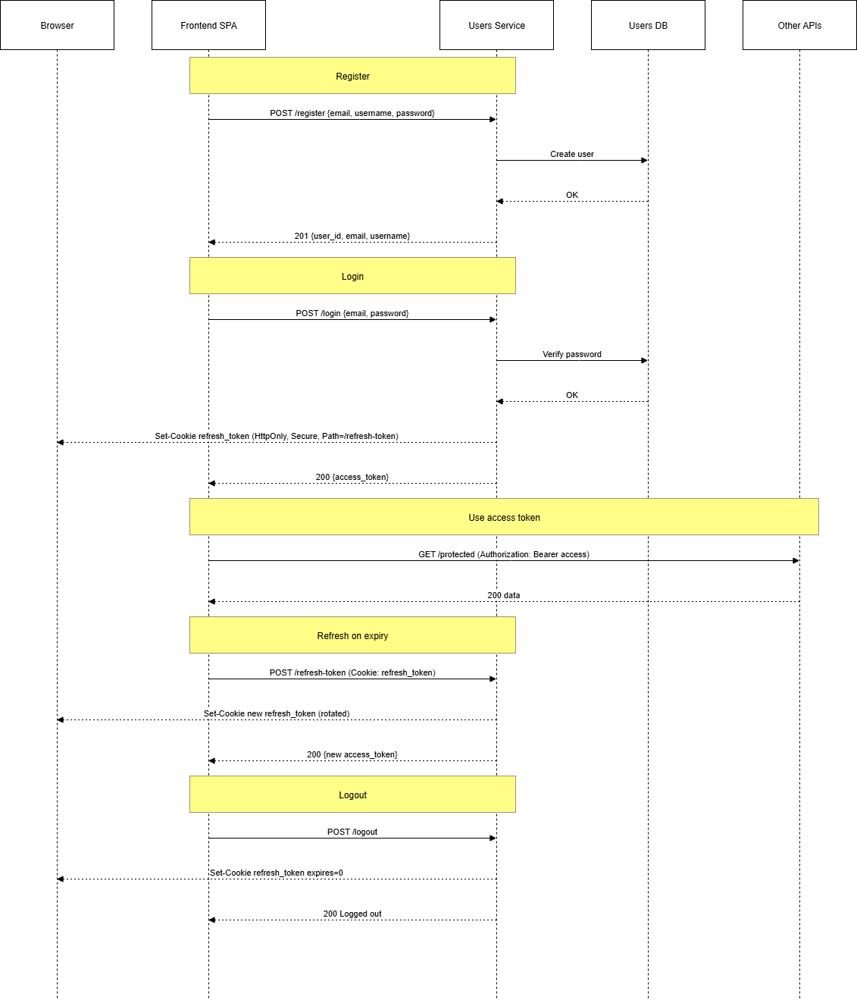

# BookStore — React SPA + Flask Microservices

A small bookstore built as a React SPA with a Python Flask microservices backend, MySQL, and RabbitMQ for async order processing.

## Table of Contents

- [Tech Stack](#tech-stack)
- [Architecture](#architecture)
- [Quick Start (Docker)](#quick-start-docker)
- [Services & Ports](#services--ports)
- [Database & Seed Data](#database--seed-data)
- [API Reference](#api-reference)
- [Testing](#testing)
- [Troubleshooting](#troubleshooting)
- [Async Processing (RabbitMQ)](#async-processing-rabbitmq)
- [Realtime UX](#realtime-ux)

## Tech Stack

**Frontend**
- React + React Router (SPA)
- Tailwind CSS, shadcn/ui
- Short polling for status updates
- Book cover images stored locally

**Backend**
- Python, Flask microservices
- REST APIs
- JWT-based authentication

**Database**
- MySQL 8

**Async Messaging**
- RabbitMQ (orders exchange, direct)

**Deployment**
- Docker & Docker Compose

## Architecture


### Auth Flow


## Quick start (Docker)

1) **Prerequisites**: Docker & Docker Compose installed.
2) **Copy env**: Create a `.env` at the repo root (or copy an existing one). _Emvironment variables needed_:
```
# ---- Database: MySQL root password and DB name ----
MYSQL_PW=your_mysql_root_password 
MYSQL_DB=bookstore

# SQLAlchemy URL each service reads
dbURL=mysql+mysqlconnector://root:${MYSQL_PW}@db/${MYSQL_DB}

# ---- JWT: HMAC HS256 Key ----
JWT_SECRET_KEY=replace-with-a-strong-secret

# ---- RabbitMQ: RabbitMQ Credentials----
RABBIT_USER=guest
RABBIT_PW=guest
```
3) **Build + run**:
```bash
docker compose up --build
```
4) **Open the app**: http://localhost:5173

5) **Stop running**:
```bash
docker compose down
# or `docker compose down -v` to remove mysql data
```

### Services & Ports

| Service            | Purpose                               | Port (host) |
|--------------------|----------------------------------------|-------------|
| frontend           | Static SPA (React Router)                 | 5173 -> 80  |
| users              | Auth & user management (JWT)           | 5001 |
| books              | Book catalog & filtering               | 5002 |
| orders             | Order persistence, retrieval, and status updates                  | 5003 |
| place_order        | Create, queue order and check status (JWT-protected)       | 5004 |
| display_orders     | Retrieve user's orders (JWT-protected)          | 5005 |
| order_processing   | Worker: consumes RabbitMQ events and processes orders       | internal    |
| db (MySQL 8)       | Data store                             | 3306 (internal) |
| rabbitmq           | Message broker                         | 5672 (internal) |

> The SPA calls the APIs at `http://localhost:5001`, `5002`, `5003`, `5004`, `5005`. Compose maps these to the respective containers.

## Database & seed data

- Schema lives in `backend/database/init.sql` (Users, Books, Orders). Compose typically mounts this for auto-init on first run. If you need to seed manually:

### Users
| Field          | Type           | Notes |
|----------------|----------------|-------|
| user_id        | INT PK AI      |       |
| username       | VARCHAR(50)    |       |
| email          | VARCHAR(100)   | unique |
| password_hash  | TEXT           | PBKDF2 via Werkzeug |
| created_at     | DATETIME       |  |

### Books
| Field      | Type            | Notes |
|------------|-----------------|-------|
| book_id    | INT PK AI       |       |
| title      | VARCHAR(255)    |       |
| description| TEXT            |  |
| ISBN       | VARCHAR(20)     |       |
| authors    | TEXT            | comma-separated |
| publishers | VARCHAR(255)    |  |
| format     | VARCHAR(50)     | Paperback/Hardcover/etc |
| genre      | VARCHAR(50)     | e.g., Fantasy, Mystery |
| price      | DECIMAL(10,2)   |       |
| quantity   | INT             | stock |
| url        | TEXT            | cover image URL |

### Orders
| Field      | Type            | Notes |
|------------|-----------------|-------|
| order_id   | INT PK AI       |       |
| book_id    | INT FK -> Books |       |
| user_id    | INT FK -> Users |       |
| price      | DECIMAL(10,2)   | copy at purchase time |
| quantity   | INT             |       |
| status     | VARCHAR(20)     | pending/completed/failed |
| title      | VARCHAR(255)    | copy at purchase time |
| authors    | TEXT            | copy at purchase time |
| url        | TEXT            | image URL copy |
| order_date | DATETIME        |  |

## API Reference

> All docs live under `docs/`

**Services**
- [Users Service API](docs/USERS_API.md)
- [Books Service API](docs/BOOKS_API.md)
- [Orders Service API](docs/ORDERS_API.md)
- [Place Order Service API](docs/PLACE_ORDER_API.md)
- [Display Orders Service API](docs/DISPLAY_ORDERS_API.md)

**Worker & Shared**
- [Order Processing Worker](docs/ORDER_PROCESSING_WORKER.md)
- [Shared Helpers](docs/SHARED_HELPERS.md)

## Testing

The backend uses **pytest** with three markers:

- `unit`: fast, isolated tests (SQLite in-memory via `dbURL=sqlite:///:memory:`)
- `integration`: hits Flask apps with a real DB
- `e2e`: cross-service tests (for Compose-based runs)

### Run commands

```bash
pytest                 # run everything
pytest -m unit         # only unit
pytest -m integration  # integration tests
```

### Layout

```
backend/
  users/
    tests/
  books/
    tests/
  orders/
    tests/
  place_order/
    tests/
  display_orders/
    tests/
  order_processing/
    tests/
pytest.ini
```

## Troubleshooting

- **Frontend can’t reach services**: ensure ports 5001–5005 are published on the host. Verify with `docker compose ps`.
- **RabbitMQ connection errors**: confirm broker is healthy and credentials match `RABBIT_USER/RABBIT_PW`.
- **JWT errors (401)**: the SPA must send `credentials: "include"` for endpoints that set/read the refresh cookie.

## Async Processing (RabbitMQ)
(More in Shared Helpers Documentation)
- **Exchange**: `orders` (direct)  
- **Routing key**: `order.new`  
- **Queue**: `order_queue`

### Publisher
- **Service**: `place_order`
- **When**: After `POST /placeorder` creates an order via `orders` service (status `pending`).
- **Payload** (abridged):
```json
{ "order_id": 123, "book_id": 1, "quantity": 1 }
```

### Consumer
- **Service**: `order_processing` (worker)
- **Behavior**:
  1. Simulates work with ~5s delay.
  2. Calls `books PUT /books/{book_id}/decrement` to reduce stock.
  3. Calls `orders PUT /orders/{order_id}` to update `status` to `completed` (or `failed` on error).

### Reliability notes
- Message delivery is **at-least-once**. To harden:
  - add a `processed_at` flag/version on Orders to ensure idempotency
  - configure a DLQ + retry policy


## Realtime UX

This project uses **short polling** from the SPA rather than WebSockets.

### After placing an order
- SPA receives `{ "order_id": <id>, "status": "pending" }` from **place_order**.
- SPA polls **place_order** `GET /checkorder/{order_id}` every 2 seconds until status becomes `completed` or `failed`.

### Disabling the "Purchase" button
- On the book detail page, the SPA calls **place_order** `GET /pendingorder/{book_id}` on initial render to decide if the button should show **“Order is processing”**, in which the button is disabled to prevent user from placing duplicate orders.
